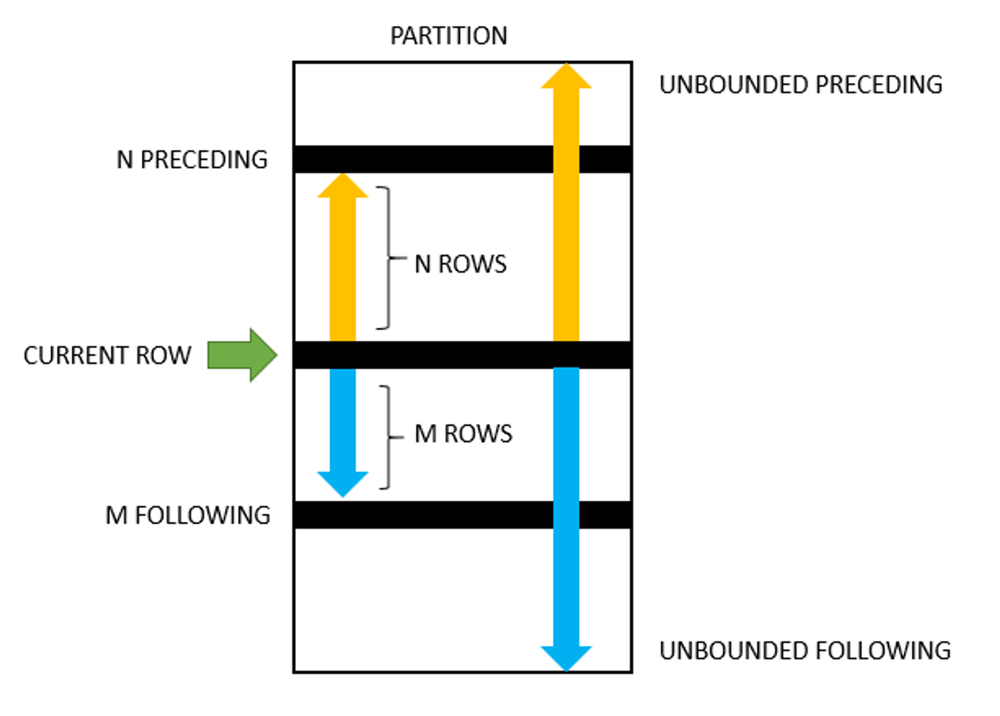

# 윈도우 함수

# 1. LAG,LEAD
```sql
LEAD(column, 1) OVER (PARTITION BY @ ORDER BY @)
-- LEAD는 한칸 당기기 (뒤에 시간 가져오기)
LAG(column, 1) OVER (PARTITION BY @ ORDER BY @)
-- LAG는 한칸 밀기(앞에 시간 가져오기)
```

# 2.SUM()
```sql
SELECT category
     , sub_category
     , ROUND(sum_sales, 2) sales_sub_category
     , ROUND(SUM(sum_sales) OVER (PARTITION BY category), 2) sales_category
     , ROUND(SUM(sum_sales) OVER (), 2) sales_total
     , ROUND(sum_sales / SUM(sum_sales) OVER (PARTITION BY category), 2) AS pct_in_category
     , ROUND(sum_sales / SUM(sum_sales) OVER (), 2) AS pct_in_total
FROM (
  SELECT category
       , sub_category
       , SUM(sales) sum_sales
  FROM records
  GROUP BY category, sub_category
) sales
```

그냥 SUM쓰면 groupby 해야하는데 윈도우함수로 쓰면 일반적으로 그냥 붙여서 쓸수 잇다.

# 3. RANK, DENSE_RANK, ROW_NUMBER

row_number : 중복되는 숫자 없이 그냥 번호 매기기

dense_rank : 순위매기는데 중간에 생략되는 숫자 없음 (e.g. 1등, 공동2등,공동2등 , 3등)

rank : 순위매기는데 생략되는 숫자 있을수잇음 (e.g. 공동1등, 공동1등, 3등)

# Named Window
```sql
SELECT measured_at
     , pm10
     , RANK() OVER w AS rk
     , DENSE_RANK() OVER w AS dense_rk
     , ROW_NUMBER() OVER w AS row_n
FROM measurements
-- 'WINDOW 윈도우이름 AS (윈도우스펙)' 형식으로 작성
WINDOW w AS (ORDER BY pm10 DESC)
ORDER BY rk
```

# 누적합, 이동평균 윈도우 사용해서


```sql
-- 윈도우 함수를 이용한 이동 평균 풀이
SELECT measured_at
     , pm10
     , AVG(pm10) OVER (ORDER BY measured_at ROWS BETWEEN 1 PRECEDING AND 1 FOLLOWING) AS pm10_running_average
FROM measurements
ORDER BY measured_at
```

```sql
-- SELECT 서브쿼리를 이용한 이동 평균 풀이
SELECT measured_at
     , pm10
     , (SELECT AVG(pm10) FROM measurements m2 WHERE m2.measured_at BETWEEN DATE_SUB(m1.measured_at, INTERVAL 1 DAY) AND DATE_ADD(m1.measured_at, INTERVAL 1 DAY))  AS pm10_running_average
FROM measurements m1
ORDER BY measured_at
```
```sql
-- 윈도우 함수를 이용한 누적합 풀이
SELECT measured_at
     , pm10
     , SUM(pm10) OVER (ORDER BY measured_at ROWS UNBOUNDED PRECEDING) AS pm10_running_total
FROM measurements
ORDER BY measured_at
```
```sql
-- SELECT 서브쿼리를 이용한 누적합 풀이
SELECT measured_at
     , pm10
     , (SELECT SUM(pm10) FROM measurements m2 WHERE m2.measured_at <= m1.measured_at) AS pm10_running_total
FROM measurements m1
ORDER BY measured_at
```

